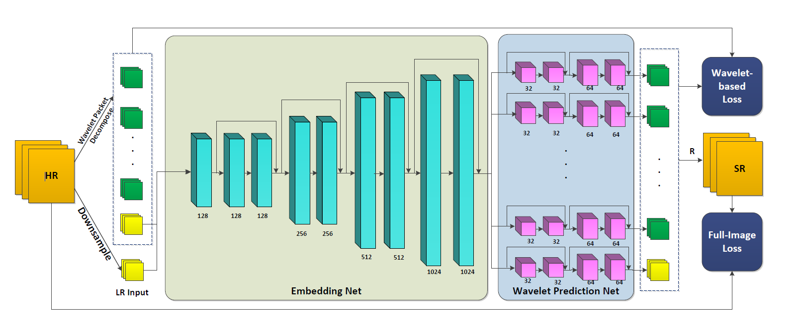

# Evolution of Wavelet-SRNet in PyTorch

Project developed by Lauro, Improta, and Pirozzi for the **Multimedia Signal Processing** course during the **2025/2026 academic year**, under the supervision of professors **Luisa Verdoliva** and **Davide Cozzolino**. The project focuses on **8× face super-resolution** through signal processing and deep learning techniques.

## Objective

The project builds upon the paper *Wavelet-SRNet: A Wavelet-Based CNN for Multi-scale Face Super Resolution* (ICCV 2017) and its original implementation.

The goal was to understand and reproduce the proposed method, modernize its implementation in **PyTorch**, and subsequently extend it by introducing an ArcFace-based identity constraint to improve identity preservation in reconstructed faces.

The project therefore combines **signal processing and deep learning**, applying wavelet transforms and convolutional neural networks to the face super-resolution problem.

## Wavelet-SRNet

Wavelet-SRNet is a **Convolutional Neural Network (CNN)** that approaches super-resolution in the **wavelet domain** rather than directly predicting the pixels of the high-resolution image.

Through the **Wavelet Packet Transform (WPT)**, image information is represented by coefficients associated with different spatial and frequency components. The model learns to predict these coefficients, separating the global image structure from high-frequency details such as edges and textures.

The final high-resolution image is reconstructed through a fixed, non-trainable **Haar Inverse Wavelet Transform (IWT)**.

In our case, the model performs **8× super-resolution**, taking **16×16-pixel** face images as input and producing **128×128-pixel** outputs.

The original loss function combines multiple objectives, including the error on the predicted wavelet coefficients, a term designed to preserve high-frequency components, and the reconstruction error on the final image.



## Reimplementation and Modernization

A significant part of the project focused on analyzing and modernizing the original implementation.

The codebase, originally based on outdated versions of Python and PyTorch, was reorganized into a modern and modular pipeline, separating:

- model and network architecture;
- dataset management and preprocessing;
- loss functions;
- evaluation metrics;
- experiment configurations;
- training and testing;
- logging and checkpointing.

## ArcFace-based Identity Loss

The main extension introduced in the project is an **ArcFace-based Identity Loss**.

This component compares the reconstructed face and the ground-truth image in the deep feature space extracted by a pretrained ArcFace network. It guides the model not only toward accurate reconstruction of pixels and wavelet coefficients, but also toward preserving identity-related facial characteristics.

During training, a frozen **ArcFace R50** model is used for the identity loss, while a separate **R100** model is used exclusively for evaluation.

## Experimental Evaluation

The extended model is compared with Wavelet-SRNet without Identity Loss and with bicubic interpolation.

The experiments use **CelebA** for training and primary evaluation, with **Helen** used for cross-dataset testing.

Performance is analyzed through several complementary metrics:

- **PSNR** and **SSIM** for reconstruction quality;
- **LPIPS** for perceptual similarity;
- **ArcFace cosine similarity** for identity preservation.

## Technologies and Main Topics

**Signal Processing:** Wavelet Transform, Wavelet Packet Transform, Haar Wavelets, frequency components, image reconstruction

**Machine Learning:** Deep Learning, Convolutional Neural Networks, perceptual learning, feature embeddings

**Tools:** Python, PyTorch, Torchvision, TensorBoard, YAML

**Experimental Evaluation:** PSNR, SSIM, LPIPS, ArcFace cosine similarity

## Running the Project

Install `torch` and `torchvision` for your CPU/CUDA environment, then run:

```bash
pip install -r requirements.txt

python train.py --config configs/config_8x.yaml

python test.py --config configs/config_8x.yaml --checkpoint results/8x/checkpoints/best.pth --save-images
```

## Technical Report

The technical report (docs/Wavelet-SRNet Lauro, Improta, Pirozzi) provides a detailed description of the architecture, ArcFace-based Identity Loss, efficiency choices, and experimental protocol, while clearly distinguishing the project's contributions from the original method and from quantitative results that are yet to be documented.

## References

The original Wavelet-SRNet method is described in:

> Huang, H., He, R., Sun, Z., and Tan, T. “Wavelet-SRNet: A Wavelet-Based CNN for Multi-Scale Face Super Resolution.” *Proceedings of the IEEE International Conference on Computer Vision (ICCV)*, 2017, pp. 1689–1697.


